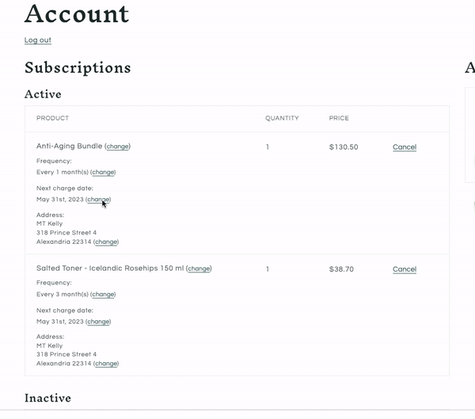

# SDK Example Theme

**This example theme is provided as a starting point for storefront development. Please ensure that you are following web development & security best practices while developing your storefront experience.**

This theme was created to show off some of what is possible using the SDK. This example theme is based off of the Shopify Refresh (version 8.0.0) theme. This theme is very similar to Dawn (version 8.0.0) but with styling changes. The layout of the files and folders in this repo should match the Shopify themes making it easy to compare to standard Shopify themes.

  
View Theme Example

**Most of the examples will require a customer to be authenticated and should be shown on the customer's account page.**

  
View Login Example

## Init SDK

Import Recharge SDK script and call init in [theme.liquid](./layout/theme.liquid#L37-L51)

For additional details please see [Script Setup](https://storefront.rechargepayments.com/client/docs/getting_started/script_setup/) documentation.

## Auth

In these examples most components login independently. This allows the components to be a little more portable. For additional details on auth please see the [Auth](https://storefront.rechargepayments.com/client/docs/methods/api/auth/) documentation.

## Account Customer Display

In the following examples we show you how you could update the customer account page to render additional information about subscriptions and orders they have made via Recharge. In these examples we replace the [main-account.liquid](./sections/main-account.liquid) template with our own [rc-account.liquid](./sections/rc-account.liquid) by updating the [account.json](./templates/customers/account.json) file with `rc-account`.

As you can see `rc-account.liquid` renders several of our own snippets for subscriptions, orders, and addresses.

### Render Customer Subscriptions

The [rc-account-subscriptions.liquid](./snippets/rc-account-subscriptions.liquid) snippet shows how you can render a list of subscriptions. It also demonstrates how to implement the following user actions:

- [Pause a subscription](./snippets/rc-account-subscriptions.liquid#L208-L211)
- [Cancel an active subscription](./snippets/rc-account-subscriptions.liquid#L213-L218)
- [Activate a cancelled subscription](./snippets/rc-account-subscriptions.liquid#L220-L223)
- [Change subscription charge date](./snippets/rc-account-subscriptions.liquid#L88-L96) (via [rc-datepicker.liquid](./snippets/rc-datepicker.liquid))
- [Edit subscription address](./snippets/rc-account-subscriptions.liquid#L241-L248) (via [rc-edit-sub-address.liquid](./snippets/rc-edit-sub-address.liquid))
- [Swap subscription products](./snippets/rc-account-subscriptions.liquid#L98-L105) (via [rc-swap-product.liquid](./snippets/rc-swap-product.liquid))
- [Update subscription frequency](./snippets/rc-account-subscriptions.liquid#L107-L129) (via [rc-update-frequency.liquid](./snippets/rc-update-frequency.liquid))

  
Change Subscription Charge Date Example

  
Swap Subscription Products Example

  
Change Subscription Frequency Example

### Render Customer Orders

The [rc-orders.liquid](./snippets/rc-orders.liquid) snippet shows how you can render a list of orders.

### Render Addresses

The [rc-addresses.liquid](./snippets/rc-addresses.liquid) snippet shows how you can render a list of addresses associated with their subscriptions. It also demonstrates how to implement the following user actions:

- [Update an address](./snippets/rc-addresses.liquid#L301-L304)
- [Add a new address](./snippets/rc-addresses.liquid#L161-L176)
- [Delete an address](./snippets/rc-addresses.liquid#L178-L183)

  
Update Address Example

## Add to next order

Render a widget that will give authenticated customers the ability to add products to their next subscription delivery.

  
Add to Next Order Example

In this example we render the [rc-widget.liquid](./snippets/rc-widget.liquid) snippet inside of [main-product.liquid](./sections/main-product.liquid#L85-L86). For more details of what the widget is doing see [rc-widget.js](./assets/rc-widget.js).
